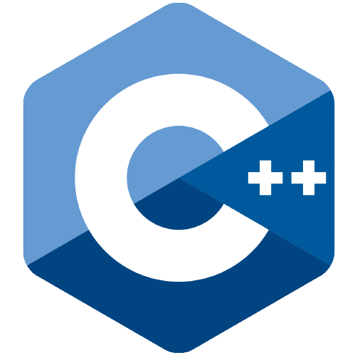

# Hello there, I’m Edgiest 👋

## I'm an Italian Student!
* 🍰 No problems when working with others: English, a **piece of cake**!
* 👀 I’m very interested in *automation* and *problem solving*
* 🔥 I’m currently learning whatever I find interesting
* 🧩 I’m looking forward to collaborate with anybody
* ⚡ I love learning and undergoing new challenges!
* 👑 Eat, Sleep, Code, Repeat!

 

# Languages and Tools:

 
 

# Github stats

    
    

